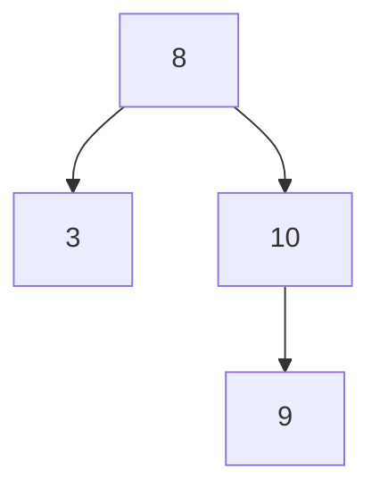

# 2.5. 二叉搜索树与查找

先修建议：[数组与链表的访问模型](./arrays-linked)。

二叉搜索树用左右分区缩小查找范围：在本节约定下，左子树小于当前值，右子树大于当前值。树形本身决定查找要走多远；二叉并不自动意味着平衡。

## 搜索树不变量与路径 {#concept-1}



搜索 9：比较 8 后去右子树，比较 10 后去左子树，再命中 9。只要每层都保持同一分区规则，不需要访问所有节点。重复值需要另定策略，例如计数或允许某一侧，不默默破坏不变量。

## 不提前引入类的教学模型 {#concept-2}

节点用 `(value,left,right)`，空节点用 None。下面仅展示查找，不作为生产树容器：

```python
tree = (8, (3, None, None), (10, (9, None, None), None))

def contains(node, target):
    while node is not None:
        value, left, right = node
        if target == value:
            return True
        node = left if target < value else right
    return False

assert contains(tree, 9)
assert not contains(tree, 7)
assert not contains(None, 1)
```

查找成本 O(h)，h 是树高。平衡时通常近似 log n，按单调值插入的普通树可能退化成链，h 达到 n；不能把未经平衡的搜索树描述为无条件 O(log n)。

## 查找、遍历与业务方案 {#concept-3}

中序遍历按左、根、右访问，在约定成立时得到有序值。遍历完整树仍需访问所有节点。后续递归课会用这个结构说明调用栈，避免在学习树时同时跳进未知对象模型。

普通有序列表可使用 bisect 做查找；大量动态有序索引优先评估数据库索引或成熟有序容器。平衡、删除、并发与持久化都不是这段教学模型自动提供的能力。

## 动手练习与验收 {#lab}

1. 手工记录查找 3、9、11 的比较路径。
2. 构造只有右孩子的树，说明为何会退化。
3. 给重复值定义规则，再判断一棵给定树是否保持规则。

依据：[bisect](https://docs.python.org/3/library/bisect.html)、[Python 数据结构](https://docs.python.org/zh-cn/3/tutorial/datastructures.html)。
