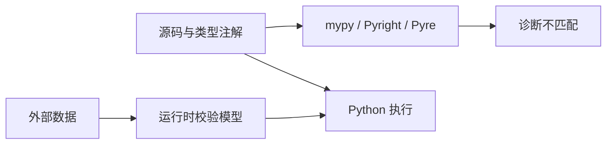

# 11.1. typing、mypy、Pyright 与 Pyre

先修建议：[类、实例、方法与数据建模](./objects)、[函数、内置函数与作用域](./functions)。

类型标注给检查器、编辑器和读者描述接口；普通 Python 不因注解自动拒绝错误输入。原图的 typing、mypy、Pyright、Pyre 是静态部分，Pydantic 在下一节独立解释运行时校验。

## 具体类型、Union 与容器 {#concept-1}

```python
def average(values: list[float]) -> float:
    if not values:
        raise ValueError("至少需要一个数")
    return sum(values) / len(values)

assert average([1.0, 2.0]) == 1.5
```

`str | None` 表示可选值，使用前应缩小 None 分支；list[str] 表达元素类型。Any 会弱化检查，用在确实不知道类型的边界，不作为绕过所有错误的默认选择。

## TypedDict 与 Protocol {#concept-2}

```python
from typing import Protocol, TypedDict

class TaskData(TypedDict):
    title: str
    done: bool

class Reader(Protocol):
    def read(self) -> str: ...

class MemoryReader:
    def read(self) -> str:
        return "Python"

def load(reader: Reader) -> str:
    return reader.read()

record: TaskData = {"title": "学习", "done": False}
assert load(MemoryReader()) == "Python"
assert record["done"] is False
```

TypedDict 描述字典形状，不自动验证外部 JSON。Protocol 描述使用方需要的行为，不要求继承同一巨型基类。运行时检查和静态结构契约分别设计。



## 检查器的真实工作流 {#concept-3}

| 工具 | 入口与定位 | 配置重点 |
| --- | --- | --- |
| mypy | 对 Python 文件/包作静态分析 | Python 版本、strict 程度、导入与第三方 stubs。 |
| Pyright | 官方 npm 工具与编辑器集成 | 环境、include、检查模式和目标版本。 |
| Pyre | 原路线中的类型检查方案 | 截至核对日官方仓库已归档，保留历史节点；新项目评估当前维护的检查器。 |

示例检查命令 `python -m mypy src`，要求安装对应工具并存在 src。Pyright 核心通过官方 npm/编辑器途径使用，不把同名包装误当所有来源等价。选择一套主检查流程，工具升级与规则变化单独验证。

[Pyre 官方仓库](https://github.com/facebook/pyre-check)在核对时为归档状态，主页介绍后续 Pyrefly。保留原路线的 pyre 对应关系，维护状态以仓库事实为准，不把旧主页的开发宣传当作最新状态。

## 动手练习与验收 {#lab}

1. 故意传 list[str] 给 average，让检查器报告，再修复。
2. 为 None 分支、TypedDict 缺字段与 Protocol 缺方法建立检查样例。
3. 用运行时坏 JSON 说明为什么静态检查通过不代表输入已验证。

依据：[Python typing](https://docs.python.org/3/library/typing.html)、[类型规范](https://typing.python.org/)、[mypy](https://mypy.readthedocs.io/en/stable/)、[Pyright](https://github.com/microsoft/pyright)、[Pyre](https://pyre-check.org/)。
