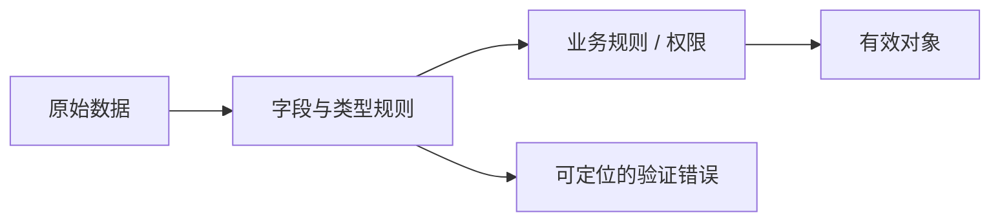

# 11.2. Pydantic 与运行时数据校验

先修建议：[typing、mypy、Pyright 与 Pyre](./typing)。

外部 JSON、配置和表单直到运行时才出现。验证模型明确字段、范围、未知值与转换策略，不能只因为源码加了类型注解就认为输入合法。

## Pydantic 模型与严格性 {#concept-1}

示例采用 Pydantic v2 API，项目中记录验证过的版本：

```python
from pydantic import BaseModel, ConfigDict, Field, ValidationError

class TaskInput(BaseModel):
    model_config = ConfigDict(extra="forbid", strict=True)
    title: str = Field(min_length=1, max_length=100)
    done: bool = False

valid = TaskInput.model_validate({"title": "学习 Python", "done": False})
assert valid.model_dump() == {"title": "学习 Python", "done": False}
try:
    TaskInput.model_validate({"title": "Go", "done": "false"})
except ValidationError:
    pass
else:
    raise AssertionError("严格布尔不能接受文本")
```

转换与严格验证是明确选项：宽松解析便于某些来源，严格模式防止接口悄悄接受字符串布尔等值。标题 min_length 不拒绝纯空白，要增加清理/业务规则；model_dump 是输出转换，不等于数据库事务。

## 字段规则与错误 {#concept-2}



field_validator 用于字段转换与校验，跨字段关系使用对应模型规则。错误响应给出公开字段信息，避免完整原始输入或凭据泄露。unknown fields 是否拒绝、null 与缺失是否等价、零值是否允许都写入契约。

## 与 dataclass 和类型检查分工 {#concept-3}

内部已经可信的数据适合 dataclass；外部结构校验可用 Pydantic；mypy/Pyright 检查源码接口。不要把三者叫成同一个“类型系统”，也不为已有能力自造通用验证框架。

## 动手练习与验收 {#lab}

1. 测试未知字段、空标题、纯空白、null 和错误 done 类型。
2. 定义完整替换与局部更新的缺失字段语义。
3. 将错误映射到接口契约，公开说明保持稳定而不依赖内部报错全文。

依据：[Pydantic](https://docs.pydantic.dev/latest/)、[严格模式](https://docs.pydantic.dev/latest/concepts/strict_mode/)。
