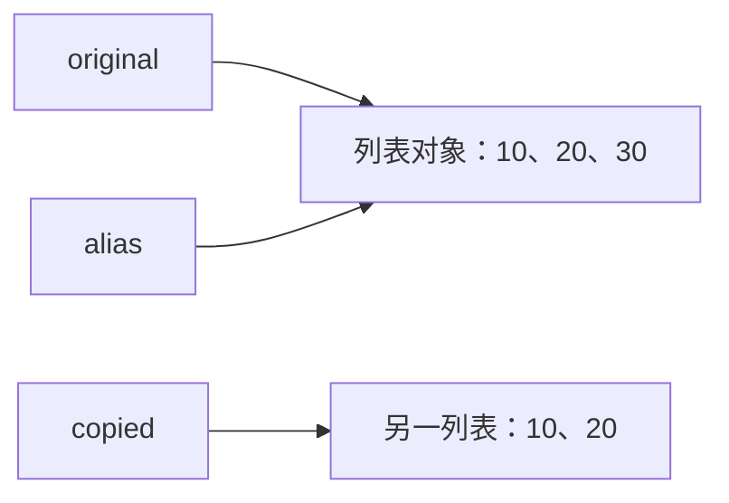

# 1.3. 变量、数据类型与类型转换

先修建议：[语法、缩进、输入与输出](./basics)。

Python 的名字绑定对象，类型属于对象。赋值一个列表通常不会复制列表；给名字重新赋值也不会把原对象变成另一种类型。先分清绑定、身份和内容，才能理解后面的参数与容器行为。

## 名字与共享对象 {#concept-1}

```python
original = [10, 20]
alias = original
copied = original.copy()
alias.append(30)
assert original == [10, 20, 30]
assert copied == [10, 20]
assert alias is original
```



`is` 检查是不是同一个对象，`==` 检查值是否相等。copy 是浅复制，内部若包含列表等对象仍可能共享；不能把它称为“所有内容都独立”。

## 数值、布尔与 None {#concept-2}

| 类型 | 用途 | 边界 |
| --- | --- | --- |
| int | 整数计数 | 任意精度，仍受内存和输入规模约束。 |
| float | 二进制浮点计算 | 近似值，注意 NaN、Inf 与容差。 |
| complex | 实部与虚部 | 数值算法按领域需求使用。 |
| bool | True/False 状态 | 是 int 的子类，外部严格布尔需要专门校验。 |
| None | 未提供或无结果 | 与 0、空字符串、空集合不是同一值。 |

```python
from decimal import Decimal
import math

assert 7 // 3 == 2
assert -7 // 3 == -3  # 向负无穷取整
assert 2 ** 10 == 1024
assert Decimal("0.1") + Decimal("0.2") == Decimal("0.3")
assert math.isclose(0.1 + 0.2, 0.3)
assert complex(2, 3) * complex(2, 3) == complex(-5, 12)
assert bool([]) is False
assert None is not False
```

金额采用最小单位整数或明确的 Decimal 规则，不先变 float 再假装精确。判断 None 用 `is None`，不以 `if not value` 代替所有缺失检查：0 可能是合法数值。

## 文本与类型转换 {#concept-3}

str 表示 Unicode 文本，bytes 表示字节。`len("中文")` 是 2，UTF-8 编码后是 6 字节；码点数量仍不总等于可见字形数量。

```python
text = "中文"
assert len(text) == 2
assert len(text.encode("utf-8")) == 6
assert int(" 42 ") == 42
assert int(3.9) == 3  # 截断，不是四舍五入
assert str(42) == "42"
assert bool("False") is True  # 非空文本，不是解析布尔
```

Type Casting 不自动完成业务校验。解析失败可能抛异常，解析成功还要看范围和单位；布尔文本使用明确允许值表，不依赖 bool(text)。

## 动手练习与验收 {#lab}

1. 用嵌套列表比较赋值、浅复制和深复制，指出哪些对象共享。
2. 写布尔文本解析，允许 true/false，拒绝其他输入。
3. 对 None、0、""、[] 分别解释身份、类型和真值。
4. 测试 3.9、-3.9 的 int 转换与 // 的区别。

依据：[内置类型](https://docs.python.org/3/library/stdtypes.html)、[内置函数](https://docs.python.org/3/library/functions.html)、[copy](https://docs.python.org/3/library/copy.html)。
