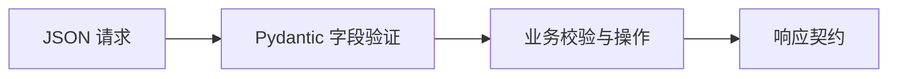

# 8.2. FastAPI 与接口开发

先修建议：[框架路线、WSGI 与 ASGI](./frameworks)。

FastAPI 把请求模型、路由与响应声明连接起来。框架负责协议处理，业务仍需定义字段规则、授权、存储和失败语义；先完成最小请求，再进入完整项目。

## 可运行接口与请求模型 {#concept-1}

在项目环境安装 `python -m pip install fastapi uvicorn httpx`，保存 app.py：

```python
from fastapi import FastAPI
from pydantic import BaseModel, ConfigDict, Field

app = FastAPI()

class TaskCreate(BaseModel):
    model_config = ConfigDict(extra="forbid")
    title: str = Field(min_length=1, max_length=100)

@app.post("/tasks", status_code=201)
def create_task(task: TaskCreate):
    return {"title": task.title, "done": False}
```

`python -m uvicorn app:app --host 127.0.0.1 --port 8000` 启动。此例不存储数据；BaseModel 对外部 JSON 进行运行时验证，普通 Python 类型标注本身不做这个工作。

## 在进程内验证契约 {#concept-2}

保存 test_app.py：

```python
from fastapi.testclient import TestClient
from app import app

client = TestClient(app)
assert client.post("/tasks", json={"title": "学习 Python"}).status_code == 201
assert client.post("/tasks", json={"title": ""}).status_code == 422
assert client.post("/tasks", json={"title": "Go", "id": 1}).status_code == 422
assert client.post("/tasks", json={"title": "Go"}).json() == {"title": "Go", "done": False}
```

这可以直接运行，也可改为 pytest 测试函数。接口返回与模型验证通过不代表“只有空白的标题”等业务规则已满足；补充 strip 校验和错误测试。完整严格校验、SQLite 与生命周期见 [任务 API 项目](./project-api)。



## 依赖、错误与生命周期 {#concept-3}

Depends 用来装配请求范围依赖，HTTPException 表达公开错误，response_model 限制对外结构。认证确认身份，授权确认可以访问哪条资源；列表也要过滤归属。body 大小、超时和外部调用由服务边界配置，不只靠字段长度。

普通 def 入口可在线程池执行，async def 在异步路径运行。后者不要直接放同步长 I/O 或 CPU 重工作；异步资源在 lifespan/async context 中管理，失败与关闭必须收拢。

## 动手练习与验收 {#lab}

1. 为标题增加空白处理，测试空串、纯空白、长度边界和未知字段。
2. 增加查询不存在资源的 404，保持内部错误不直接暴露。
3. 把最小接口升级为完整项目，数据重启保留并通过接口测试。

依据：[FastAPI](https://fastapi.tiangolo.com/)、[Pydantic](https://docs.pydantic.dev/latest/)。
